<h2>SE Utilities</h2>

A collection of utility fragments that can be used to help create pages.

<h3>Modal</h3>

Configuration | Type | Default Value | Description
------------- | ---- | ------------- | -------------
Delay in ms to Show Modal | text | 3000 | 
Footer Button Type | select | primary | 
Modal Vertical Alignment | select |  | 

<h3>Flex Container</h3>

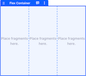

Configuration | Type | Default Value | Description
------------- | ---- | ------------- | -------------
Items | text | 3 | 
Flex Direction | select |  | 
Align Items | select | align-items-center | 
Justify Content | select | justify-content-between | 
Flex Wrap | select |  | 

<h3>Constrained Image</h3>

Configuration | Type | Default Value | Description
------------- | ---- | ------------- | -------------
Aspect Ratio Height | text | 3 | 
Aspect Ratio Width | text | 4 | 

<h3>Fragment Context Display</h3>

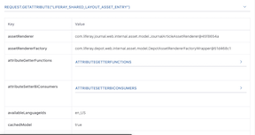

<h2>SE Header Components</h2>

A collection of fragments that can be used to build a page header.

<h3>Site Name</h3>

Configuration | Type | Default Value | Description
------------- | ---- | ------------- | -------------
Heading Level | select | h2 | 

<h3>Navigation</h3>

<h3>Site Logo</h3>

Configuration | Type | Default Value | Description
------------- | ---- | ------------- | -------------
Image Alternate Text | text | site-logo | 
Image Height | text | 56px | 
Image Width | text | 56px | 

<h3>User Personal Bar</h3>

<h3>Language Selector</h3>

<h3>Search</h3>

<h2>SE Components</h2>

A collection of fragments that can be used to composed pages mostly based off of Liferay's Clay web component framework.

<h3>Clay Alert</h3>

Configuration | Type | Default Value | Description
------------- | ---- | ------------- | -------------
Alert Type | select | alert-info | 
Display as Stripe | checkbox | False | 
Dismissable | checkbox | True | 
Hide Alert automatically | checkbox | True | 
Hide Delay (ms) | text | 5000 | 

<h3>Parallax Container</h3>

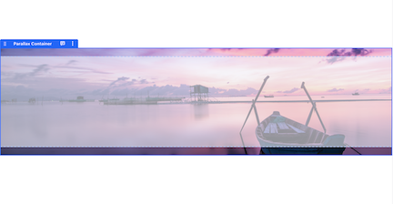

<h3>Display Heading</h3>

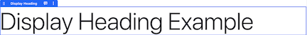

Configuration | Type | Default Value | Description
------------- | ---- | ------------- | -------------
Heading Level | select | display-2 | 

<h3>Clay Icon</h3>

Configuration | Type | Default Value | Description
------------- | ---- | ------------- | -------------
Icon Name | text | check-circle | 
Icon Size | select | 32px | 

<h3>Background Video Container</h3>

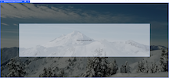

Configuration | Type | Default Value | Description
------------- | ---- | ------------- | -------------
Video URL | text | https://storage.googleapis.com/coverr-main/mp4/Mt_Baker.mp4 | 
Mobile Fallback Image | text | https://source.unsplash.com/XT5OInaElMw/1600x900 | 
Video Height | text | 75vh | 
Video Min Height | text | 25rem | 
Overlay Color | text | #000 | 
Overlay Opacity | text | 0.5 | 

<h3>Background Gradient Container</h3>

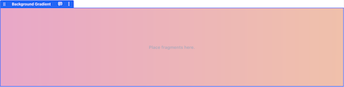

Configuration | Type | Default Value | Description
------------- | ---- | ------------- | -------------
Starting Color | text | #ee0979 | 
Finishing Color | text | #ff6a00 | 
Angle | text | 90deg | 

<h2>SE Billboard Charts</h2>

A collection of fragments build using Billboard Charts that can be used to demonstrate dashboard capabilities.

<h3>Bar Chart</h3>

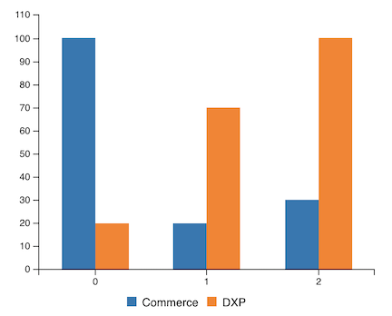

Configuration | Type | Default Value | Description
------------- | ---- | ------------- | -------------
Data | text | [["data1", 100, 20, 30], ["data2", 20, 70, 100]] | chart-data

<h3>Radar Chart</h3>

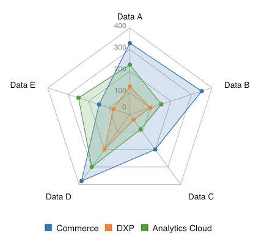

Configuration | Type | Default Value | Description
------------- | ---- | ------------- | -------------
Axis Max | text | 400 | axis-max
Level Depth | text | 4 | level-depth
Clockwise | checkbox | True | clockwise
Data | text | [["x", "Data A", "Data B", "Data C", "Data D", "Data E"],["data1", 330, 350, 200, 380, 150],["data2", 130, 100, 30, 200, 80],["data3", 230, 153, 85, 300, 250]] | chart-data

<h3>Area Chart</h3>

Configuration | Type | Default Value | Description
------------- | ---- | ------------- | -------------
Data | text | [["data1", 300, 350, 300, 0, 0, 0],["data2", 130, 100, 140, 200, 150, 50]] | chart-data

<h3>Donut Chart</h3>

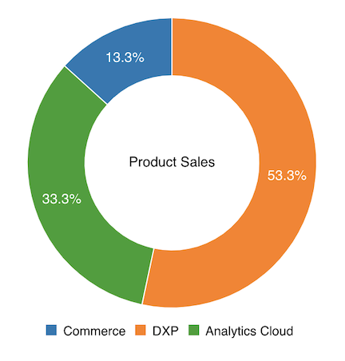

Configuration | Type | Default Value | Description
------------- | ---- | ------------- | -------------
Title | text | Donut Chart Title | chart-title
Data | text | [["data1", 30],["data2", 120],["data3", 75]] | chart-data

<h3>Line Chart</h3>

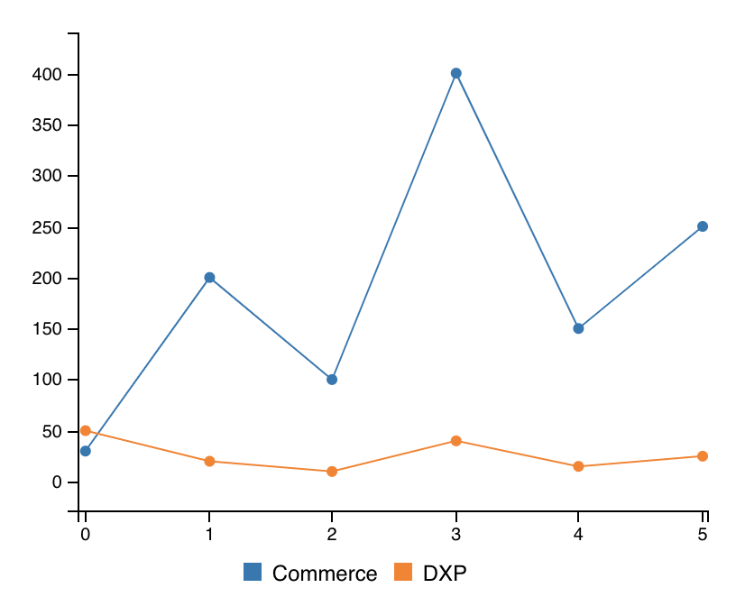

Configuration | Type | Default Value | Description
------------- | ---- | ------------- | -------------
Data | text | [["data1", 30, 200, 100, 400, 150, 250], ["data2", 50, 20, 10, 40, 15, 25]] | chart-data

<h2>SE Content Display</h2>

A collection of fragments designed to be used within a collection fragment or on a display page.

<h3>Map View</h3>

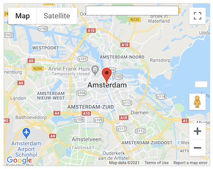

<h3>Categories</h3>

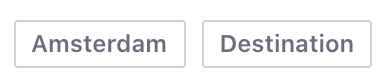

Configuration | Type | Default Value | Description
------------- | ---- | ------------- | -------------
Ignore Categories - Separate categories by commas to ignore them. | text | category | 
Hide if Empty | checkbox | False | 

<h2>SE Integrations</h2>

A collection of fragments that showcase the ease with which you can integrate other systems with Liferay.

<h3>Google Hangout</h3>

<h3>Twitter Timeline</h3>

Configuration | Type | Default Value | Description
------------- | ---- | ------------- | -------------
Twitter Handle | text | @Liferay | 
Number of Tweets to Display | text | 3 | 

<h3>LinkedIn Share Button</h3>

Configuration | Type | Default Value | Description
------------- | ---- | ------------- | -------------
Share URL | text | https://www.liferay.com | 

<h3>Tableau</h3>

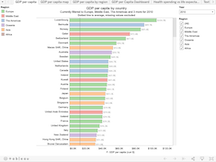

Configuration | Type | Default Value | Description
------------- | ---- | ------------- | -------------
Report Name | text | WorldIndicators/GDPpercapita | It must be something like 'WorldIndicators/GDPpercapita'.
Host URL | text | https://public.tableau.com | Use your tableau host url. Don't finish it with '/'.
Site Root (empty if you are using public.tableau.com) | text |  | Leave this field empty if you use the public Tableau server (public.tableau.com).

<h3>MicroStrategy</h3>

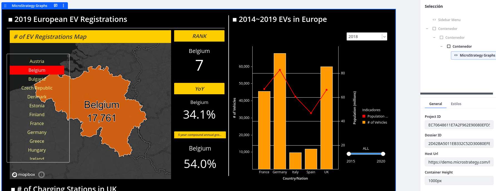

Configuration | Type | Default Value | Description
------------- | ---- | ------------- | -------------
Project ID | text | EC70648611E7A2F962E90080EFD58751 | 
Dossier ID | text | 2D62BA5011EB332C52D30080EFB56354/K53--K46 | 
Host URL | text | https://demo.microstrategy.com/MicroStrategyLibrary | 
Container Height | text | 1000px | 

<h3>Twitter</h3>

Configuration | Type | Default Value | Description
------------- | ---- | ------------- | -------------
Tweet Text | text | Let me tell you why I love @Liferay ... | 
Icon Size | select | 4 | 

<h3>Hubspot Chatbot</h3>

Configuration | Type | Default Value | Description
------------- | ---- | ------------- | -------------
Tracking Code | text | 8842647 | 

